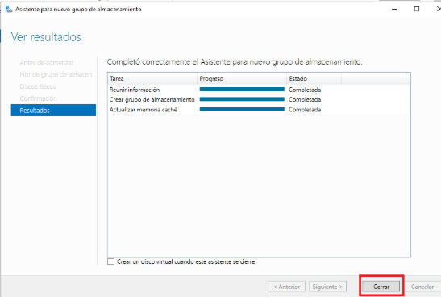
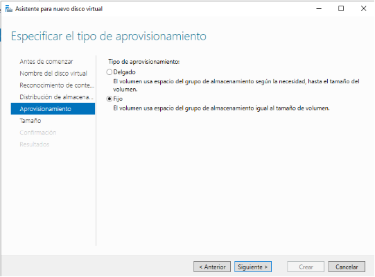
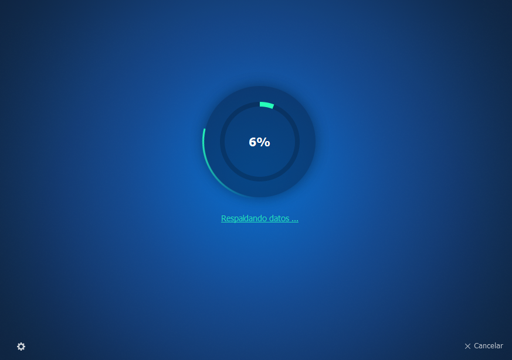

# PROYECTO CPD  
**Frances Simó Olma**  
**Jaime Climent Cardona** 
**Jonman Jimenez Mendoza**  

## ÍNDICE

- [Sprint 1](#sprint-1)
  - [1 CPD para el alojamiento del sistema de gestión de las actividades deportivas de Tavernes](#1-cpd-para-el-alojamiento-del-sistema-de-gestión-de-las-actividades-deportivas-de-tavernes)
    - [1.1 Objetivos](#11-objetivos)
    - [1.2 Requisitos](#12-requisitos)
      - [1.2.1 Requisitos del sistema de Gestión](#121-requisitos-del-sistema-de-gestión)
      - [1.2.2 Requisitos del CPD](#122-requisitos-del-cpd)
    - [1.3 WBS](#13-wbs)
    - [1.4 Cronograma](#14-cronograma)
    - [1.5 Equipo](#15-equipo)
  - [2. Documento de Roles y Responsabilidades](#2-documento-de-roles-y-responsabilidades)
    - [2.1 Roles y Responsabilidades](#21-roles-y-responsabilidades)
      - [2.1.1 Rol](211-rol)
      - 

---
## Sprint 1

## 1. CPD para el alojamiento del sistema de gestión de las actividades deportivas de Tavernes  
### 1.1 Objetivos  
- Centralizar información en una base de datos estructurada.  
- Minimizar la intervención manual.  
- Generar notificaciones automáticas.  
- Integrar herramientas de planificación.  
- Implementar mecanismos de respaldo y recuperación ante desastres.  
- Disponer de una APP para reservas.  
- Proporcionar soporte técnico.  
- Mantener escalabilidad.  
- Facilitar conexión con sistemas de pago.  
- Monitoreo y mantenimiento proactivo.  

### 1.2 Requisitos  
#### 1.2.1 Requisitos del sistema de Gestión  
- **Iniciar sesión** con usuario y contraseña.  
- **Enviar correo de confirmación** tras reservas.  
- **Agregar al carrito** reservas de pistas/puestos.  
- **Realizar pagos** seguros.  
- **Usabilidad** intuitiva para todos los usuarios.  

#### 1.2.2 Requisitos del CPD  
- **Rendimiento**: Respuesta <2 segundos.  
- **Seguridad**: Cifrado RSA en comunicaciones.  
- **Disponibilidad**: 24/7.  
- **Integridad de datos**.  
- **Recuperabilidad**: Recuperación en 30 minutos.  
- **Capacidad**: 1000 usuarios simultáneos.  
- **Confidencialidad**.  
- **Compatibilidad**: Windows y Linux.  

### 1.3 WBS  
El **Work Breakdown Structure (WBS)** que se presenta a continuación desglosa las tareas. Esto permite organizar el proyecto en tareas manejables. 

### 1.4 Cronograma  
El **Cronograma** que se presenta a continuación detalla las fases y actividades clave del proyecto, este en específico del primer sprint, permite coordinar tareas, establecer plazos y garantizar que el proyecto avance de manera ordenada y dentro de los tiempos establecidos. 

### 1.5 Equipo  
A continuación, se ve los miembros del equipo y sus roles. 
- **Jonman Jimenez Mendoza**: Líder del Proyecto.  
- **Jaime Climent Cardona**: Administrador de Infraestructura TI.  
- **Frances Simó Olmo**: Gestor de Riesgos.  

---

## 2. Documento de Roles y Responsabilidades  
En este documento se redacta los roles, responsabilidades y tareas asignadas a los miembros del equipo, para poder garantizar la colaboración y objetivos. 

El equipo encargado se encarga de la creación, gestión y mantenimiento del CPD que alojara el sistema de gestión de actividades deportivas de Tavernes. 

### 2.1 Roles y Responsabilidades  
### 2.1.1. Rol 
#### **Líder del Proyecto**  
Persona en quien recaen las responsabilidades generales y quien realiza las estimaciones sobre la capacidad de esfuerzo del equipo. 
##### 2.1.1.1 Responsabilidades
- Coordinar actividades.  
- Supervisar progreso.  
- Garantizar plazos.  
- Resolver conflictos.  
- Gestión documentación.  

### 2.1.2. Rol
#### **Administrador de Infraestructura TI**  
Encargado de diseñar, planificar y supervisar la infraestructura software y Hardware.  
##### 2.1.2.1 Responsabilidades
- Selección de hardware/software.  
- Gestión de redes y seguridad.  
- Mantenimiento y actualizaciones.  

### 2.1.3. Rol
#### **Gestor de Riesgos**
Identifica, analiza y evalúa los riesgos que podrían afectar la operación del CPD. 
##### 2.1.3.1 Responsabilidades
- Evaluación de riesgos.  
- Desarrollo de estrategias de mitigación.  
- Gestión de incidentes.  

### 2.2 Tareas Asignadas
Las **Tareas Asignadas** que se explicarán a continuación, describen las responsabilidades específicas asignadas a los distintos miembros involucrados. 
#### **Jonman Jiménez Mendoza** 
**Rol asignado:** Líder del Proyecto. 
**Tareas específicas:** 
- Dividir las fases del proyecto en tareas concretas mediante la estructura WBS (Work Breakdown Structure). 
  - Fecha inicio: 10-01-25 
  - Fecha final: 13-01-25 
- Establecer un plan detallado con la secuencia temporal de las tareas, asegurando que el sprint finalizo dentro de la fecha tope establecida. 
  - Fecha inicio:10-01-25 
  - Fecha final: 13-01-25 
- Designar un líder de proyecto responsable de la coordinación general. 
  - Fecha inicio: 14-01-25 
  - Fecha final: 20-01-25 
- Asignar responsables para cada fase y tarea específica del proyecto. 
  - Fecha inicio: 14-01-25 
  - Fecha final: 20-01-25 

#### **Jaime Climent Cardona**  
**Rol asignado:** Administrador de Infraestructura TI. 
**Tareas específicas:** 
- Identificar las necesidades de hardware y software. 
  - Fecha inicio: 10 – 01-25 
  - Fecha final: 20-01-25 
- Determinar las capacidades de procesamiento, almacenamiento y red necesarias. 
  - Fecha inicio: 14-01-25 
  - Fecha inicio: 20-01-25  

#### **Frances Simó Olmo**  
**Rol asignado:** Gestor de Riesgos. 
**Tareas específicas:** 
- Determinar la disponibilidad de recursos y planificar su adquisición o asignación. 
  - Fecha inicio: 10-01-25 
  - Fecha final: 13-01-25 
- Enumerar los recursos materiales y humanos requeridos. 
  - Fecha inicio: 10-01-25 
  - Fecha final: 13-01-25 
- Identificar posibles riesgos que puedan afectar el proyecto. 
  - Fecha inicio: 14-01-25 
  - Fecha final: 20-01-25 
- Desarrollar planes de contingencia para mitigar los riesgos identificados. 
  - Fecha inicio: 14-01-25 
  - Fecha final: 20-01-25 

### 2.3 Tareas en Equipo  
Las **Tareas en equipo** que se abordarán a continuación incluyen la planificación de las tareas de manera conjunta de todos los miembros del equipo. 
- Establecer los objetivos generales del CPD virtual. 
  - Fecha inicio: 09-01-25 
  - Fecha final: 10-01-25 
- Determinar los requisitos funcionales y no funcionales. 
  - Fecha inicio: 09-01-25 
  - Fecha final: 10-01-25 
- Revisar el plan completo del proyecto para asegurarse que todos los aspectos están cubiertos. 
  - Fecha inicio: 20-01-25 
  - Fecha final: 20-01-25 
- Obtener la aprobación final por parte del profesor y los responsables del proyecto. 
  - Fecha inicio: 20-01-25 
  - Fecha final: 23-01-25 

### 2.3.1. Mirmbros involucrados  
- Jonman Jiménez Mendoza-Líder del Proyecto  
- Jaime Climent Cardona-Administrador de Infraestructra TI  
- Frances Simó Olmo-Gestor de Riesgos

## 2.4. Firmas
Al firmar este documento se está de acuerdo y comprometen a cumplir con las tareas y responsabilidades asignadas. 

Jonman Jiménez Mendoza Jaime Climent Cardona Frances Simó Olmo 

---

## 3. Análisis de Requisitos  
El **Análisis de Requisitos** que se presentará el análisis que incluyen, materiales, de seguridad, rendimiento y escalabilidad. 
### 3.1 Materiales que se van a utilizar 
#### 3.1.1 Requisitos de Maquinaria
Todo el hardware que se va a necesitar. 

##### 3.1.1.1. Servidores
- **Servidor de aplicaciones:** 
  - Procesador: Mínimo 8 núcleos (AMD EPYC). 
  - Memoria RAM: 32 GB escalable a 64 GB. 
  - Almacenamiento: SSD de 1 TB con soporte para RAID 1. 
  - Sistema operativo: Windows Server (22.04 o superior)  
- **Servidor de bases de datos:** 
  - Procesador: Mínimo 16 núcleos. 
  - Memoria RAM: 64 GB escalable a 128 GB. 
  - Almacenamiento: SSD de 2 TB con RAID 5. 
  - Sistema operativo: Windows Server (compatible con bases de datos) 
- **Servidor de respaldo:** 
  - Procesador: Mínimo 4 núcleos. 
  - Memoria RAM: 16 GB. 
  - Almacenamiento: 4 TB HDD para backups incrementales y totales. 

##### 3.1.1.2. Estaciones de trabajo 
- Procesador: Intel i5 o equivalente. 
- Memoria RAM: 8 GB. 
- Almacenamiento: SSD de 512 GB. 
- Sistema operativo: Windows Server 22 (nos ofrecen la licencia el ayuntamiento). 

##### 3.1.1.3. Equipos de red 
- Switches de red Gigabit con soporte para VLAN. 
- Routers con redundancia y balanceo de carga. 
- Firewall hardware para protección perimetral. 
- Puntos de acceso Wifi de doble banda (2.4 GHz y 5 GHz). 

##### 3.1.1.4. Almacenamiento en red (NAS) 
- Capacidad: 10 TB escalable. 
- Soporte para RAID y replicación de datos. 
- Compatible con protocolos SMB y NFS. 

#### 3.1.2 Requisitos de Software
Todo el software que se va a necesitar 
##### 3.1.2.1. Sistema de gestión 
- Aplicación web para inscripciones y reservas. 
- Compatible con navegadores modernos (Chrome, Edge, Firefox). 
- Integración con pasarelas de pago seguras. 
- Soporte para múltiples idiomas. 

##### 3.1.2.2. Bases de datos 
- PostgreSQL o MySQL. 
- Herramientas de replicación y respaldo automático.

##### 3.1.2.3. Seguridad 
- Software de monitorización de red. 
- Antivirus y sistemas de detección de intrusiones. 
- Certificados SSL para comunicaciones seguras. 

##### 3.1.2.4. Otras herramientas 
- Sistema de virtualización: VMware o Proxmox. 
- Software de backup: Veeam o Bacula. 

#### 3.1.3 Infraestructura de Red  
##### 3.1.3.1. Conectividad 
- Conexión principal de alta velocidad: Mínimo 1 Gbps. 
- Conexión redundante con proveedor diferente para garantizar la continuidad del servicio. 

##### 3.1.3.2. Diseño de red 
- Segmentación de red mediante VLANs: 
- Red para gestión interna. 
- Red para usuarios finales. 
- Red de servidores.

##### 3.1.3.3. Seguridad 
- Firewall perimetral con inspección profunda de paquetes. 
  - IPSec, encriptación de y autentificación de trafico de red. 
  - SNORT; Detección y prevención de intrusiones. 
  - SSL; Inspección de tráfico cifrado.  
- Redes privadas virtuales (VPN) para accesos remotos seguros, con lo siguientes protocolos. 
  - WireGuard; VPN moderna, segura y rápida. 
  - OpenVpn; Protocolo basado en SSL/TLS. 
  - IPSec; Alta Seguridad para túneles VPN en redes corporativas. 
- Políticas de acceso basadas en roles. 
  - LDAP; Para la gestión de permisos en los usuarios. 
  - OAuth; Para autentificación federada en aplicaciones web. 
  - RADIUS; Autentificación de usuarios en la red wifi empresarial.  

##### 3.1.3.4. Monitorización #
- Implementación de herramientas de monitorización y alerta. 
- Gráficos en tiempo real de consumo de ancho de banda y estado del hardware. 

#### 3.1.4 Escalabilidad y Disponibilidad  
- Balanceo de carga.  
- Clúster de bases de datos.  
- Plan de recuperación ante desastres.  

---

## 4. Recursos Necesarios 
Los **Recursos Necesarios** que se abordarán a continuación, enfocados en el aspecto financiero del Proyecto para alojar el sistema de gestión de actividades deportivas de Tavernes, detallan el presupuesto requerido y su por qué. 

### 4.1 Presupuesto  
#### Hardware (Total: €20,218)  
| ELEMENTO                                   | CANTIDAD | COSTE (unidad) | COSTE TOTAL  |
|--------------------------------------------|----------|---------------|--------------|
| Servidor de aplicaciones                   | 1        | 3.776 €       | 3.776 €      |
| Servidor de bases de datos                 | 1        | 4.777 €       | 4.777 €      |
| Servidor de respaldo                       | 2        | 3.000 €       | 6.000 €      |
| NAS (10TB escalable)                       | 1        | 1.500 €       | 1.500 €      |
| Estaciones de trabajo                      | 3        | 800 €         | 2.400 €      |
| Switches de red Gigabit (paquete 24)       | 2        | 215 €         | 430 €        |
| Routers                                    | 2        | 210 €         | 420 €        |
| AP Wifi                                    | 1        | 137 €         | 137 €        |
| Medidas de seguridad físicas               | 1        | 3.500 €       | 3.500 €      |
| SAI                                        | 1        | 278 €         | 278 €        |
| **TOTAL**                                  |          |               | **23.218 €** |

- **Servidor de aplicaciones:** Son programas de servidor en una red distribuida que proporciona el entorno de ejecución para un programa de aplicaciones, es decir es el componente de tiempo de ejecución principal en todas las configuraciones y donde una aplicación se ejecuta. 
- **Servidor de base de datos:** Hardware que permite organizar la información usando tablas, índices y registros. 
- **Servidor de respaldo:** Es un tipo de servidor que facilita el respaldo de datos, archivos, aplicaciones o base de datos. 
- **NAS:**Es un dispositivo de almacenamiento conectado a la red. Su función es hacer copias de seguridad de los archivos que tú le indiques.
- **Estación de trabajo:** Consiste en equipos que se emplean en cualquier trabajo con necesidades específicas, suelen formar parte de una red de trabajo donde se almacenan archivos y carpetas. 
- **Switch de red:** Es un dispositivo informático que permite interconectar dispositivos a través de una red de área local o red LAN. 
- **Router:** Es un dispositivo de hardware que sirve de punto de conexión entre una red local e Internet. 
- **AP Wifi:** Es un dispositivo para establecer una conexión inalámbrica entre equipos y pueden formar una red inalámbrica externa. 
- **Medidas de seguridad físicas:** Se encarga de proteger todo el hardware, aquí incluimos; 
  - Extintores de C02. 
  - Detectores de humo y calor. 
  - Aspersores de gas inerte (FM-200, Novec 1230). 
- **SAI:** O UPS (Uninterruptible Power Supply), es un dispositivo que proporciona energía de respaldo en caso de fallos eléctricos.

#### Software (Total: €3,027)  
| ELEMENTO                                     | LICENCIAS | COSTE (unidad) | COSTE TOTAL  |
|----------------------------------------------|-----------|---------------|--------------|
| Sistema operativo servidores (Windows Server) | 4         | 0 €           | 0 €          |
| Soporte empresarial (MySQL)                   | 1         | 2.000 €       | 2.000 €      |
| Software de backup (Aomei Backup)             | 1         | 700 €         | 700 €        |
| Sistema de virtualización (VMWare Workstation Pro) | 1    | 193 €         | 193 €        |
| Antivirus y herramientas de seguridad (F-Secure) | 10     | 10 €          | 100 €        |
| Monitorización (Pandora FMS)                  | 1         | 34 €          | 34 €         |
| **TOTAL**                                     |           |               | **3.027 €**  |

- **Sistema operativo servidores:** Es el software que se encarga de gestionar los recursos, servicios y usuarios.  Windows Server se consideraría mejor opción para este proyecto ya que dependería del ayuntamiento de Tavernes y este ya tiene la infraestructura hecha con Windows Server y las licencia se proporcionaría gratis por el ayuntamiento.  
Soporte empresarial: El soporte empresarial que hemos decidido utilizar ha sido el MySQL para poder gestionar la base de datos del polideportivo. 
- **Software de backup:** Es la aplicación o los diferentes comandos y scripts que se utilizarán para poder realizar los backups del sistema y guardar-los. 
- **Sistema de virtualización:** Es la tecnología que se puede usar para crear las representaciones virtuales de los servidores. 
- **Antivirus y herramientas de seguridad:** Son las medidas de seguridad que se tienen en cuenta para que en caso de recibir algún ataque que no pueda ser una amenaza muy grande. 
- **Monitorización:** Las medidas que se llevan a cabo para poder observar los servidores y prevenir fallos y tomar medidas a tiempo. 

#### Infraestructura de Red (Total: €7,500)  
| ELEMENTO                              | CANTIDAD | COSTE (unidad) | COSTE TOTAL  |
|---------------------------------------|----------|---------------|--------------|
| Conexión principal (1Gbps)           | 1        | 2.500 €       | 2.500 €      |
| Conexión redundante                  | 1        | 2.000 €       | 2.000 €      |
| Estructuración y montaje de cableado  | 1        | 3.000 €       | 3.000 €      |
| **TOTAL**                             |          |               | **7.500 €**  |

- **Conexión principal:** Es la velocidad que tendrá que soportar nuestro servidor. 
- **Conexión redundante:** Es la velocidad de apoyo. 
- **Estructura y montaje de cableado:** Como se diseñará nuestra sala se servidores. 

### 4.1.4 Servicios Profesionales
| ELEMENTO                               | HORAS ESTIM. | COSTE (hora) | COSTE TOTAL  |
|----------------------------------------|--------------|-------------|--------------|
| Instalación y configuración de hardware | 50          | 50 €        | 2.500 €      |
| Configuración de software y pruebas    | 60          | 50 €        | 3.000 €      |
| Auditoría inicial de seguridad         | 20          | 80 €        | 1.600 €      |
| **TOTAL**                              |              |             | **7.100 €**  |

- **Instalación y configuración de hardware:**  Es el proceso de agregar o modificar los componentes físicos de un sistema informático, como discos duros, memorias, tarjetas gráficas, etc. 
- **Configuración de software y pruebas:** Son el proceso de evaluar y verificar que un producto o aplicación de software hace lo que se supone que debe. 
- **Auditoria inicial de seguridad:** Es un proceso estandarizado destinado a verificar que los sistemas informáticos y la información almacenada en los mismos cumplan con los estándares de seguridad requeridos. 

---

## 5. Evaluación de Riesgos y Contingencias 
La **Evaluación de Riesgos y Planificación de Contingencias** que se explicará a continuación identifica posibles problemas que podrían afectar al CPD. Esto incluye riesgos técnicos, operativos y de seguridad. Asimismo, se detallarán estrategias de mitigación y planes de contingencia para minimizar su impacto. 
### 5.1 Identificación de Riesgos

### 5.1.1. Riesgos tecnológicos
- **Fallo de hardware:** Posible avería de servidores, almacenamiento o componentes de red. 
- **Fallo de software:** Errores en el sistema operativo, bases de datos o aplicaciones. 
- **Ciberataques:** Malware, ransomware, accesos no autorizados. 
- **Pérdida de datos:** Eliminación accidental, dañado de alguno de los datos o fallos en las copias de seguridad. 
- **Fallo de red:** Interrupciones en la conexión o caída de la red interna. 

### 5.1.2. Riesgos ambientales
- **Fallo eléctrico:** Apagones, sobretensiones o fallos en la alimentación eléctrica. 
- **Incendios o inundaciones:** Desastres naturales o incidentes que afectan a la infraestructura física. 
- **Temperaturas extremas:** Fallo en el sistema de refrigeración que provoca un fallo. 

### 5.1.3. Riesgos Humanos 
- **Errores operativos:** Configuraciones erróneas, manipulación inadecuada de equipos o eliminaciones accidentales. 
- **Sabotaje interno:** Actos intencionados de empleados con acceso al sistema. 

### 5.2 Plan de Contingencia  

### 5.2.1. Medidas Preventivas 
- **Monitoreo proactivo:** Implementación de sistemas de monitoreo en tiempo real (Zabbix/Nagios) para hardware, software y redes. 
- **Backups regulares:** Copias de seguridad automatizadas y almacenamiento en una ubicación remota. 
- **Firewall y seguridad perimetral:** Uso de firewalls avanzados, IDS/IPS y software antimalware. 
- **Actualización y mantenimiento:** Aplicación de parches de seguridad y revisión periódica de sistemas. 
- **Suministro eléctrico redundante:** Uso de UPS. 
- **Capacitación del personal:** Formación en seguridad y procedimientos de emergencia para empleados. 

- **Respuesta a incidentes**:  
| Incidente         | Acciones Inmediatas                                                       |
|------------------|--------------------------------------------------------------------------|
| Fallo de hardware | Conmutación a servidores de respaldo, aviso a soporte técnico         |
| Ciberataque      | Aislamiento del sistema, análisis de logs, restauración de backup     |
| Pérdida de datos | Restauración de la última copia de seguridad, análisis de causa       |
| Corte eléctrico  | Uso de UPS y generador, notificación a proveedor eléctrico            |
| Incendio/Inundación | Activación de protocolos de evacuación, traslado a sitio alternativo |

### 5.2.4. Recuperación y Reanudación 
- **Evaluación del impacto:** Análisis del incidente y sus efectos en la operatividad. 
- **Restauración de servicios:** Implementación del plan de recuperación según la criticidad del sistema afectado. 
- **Pruebas y verificación:** Validación de la integridad de los datos y correcto funcionamiento. 

### 5.2.5. Sitio de respaldo 
- **Ubicación alternativa** con servidores espejo listos para ser activados en caso de desastre. 
- **Replicación de datos en tiempo real** para minimizar la pérdida de información.

# Sprint 2

## 3.1. Diseño de la arquitectura del diseño

## 3.2 Selección de hardware y software 

### Hardware 

| **ELEMENTO** | **CANTIDAD** | **COSTE (unidad)** | **COSTE TOTAL** |
| ------------------------ | - | - | - |
| Servidor de aplicaciones  | 1 | 3.776€ | 3.776€ |
| Servidor de bases de datos | 1 | 4.777€ | 4.777€ |
| Servidor de respaldo | 2 | 3.000 € | 6.000 € |
| NAS (10TB escalable) | 1 | 1.500 € | 1.500 € |
| Estaciones de trabajo | 3 | 800 € | 2.400 € |
| Switches de red Gigabit (paquete 24) | 2 | 215€ | 430€ |
| Routers | 2 | 210€ | 420€ |
| AP Wifi | 1 | 137€ | 137€ |
| Medidas de seguridad físicas | 1 | 3.500 € | 3.500 € |
| SAI | 1 | 278€ | 278€ |
| **TOTAL** | | | **28.318 €** |

**Servidor de aplicaciones:**  

- Hemos utilizado un servidor Dell en concreto el PowerEdge R740, ideal para aplicaciones empresariales exigentes y virtualización  
- Soporta hasta dos procesadores Intel Xenon escalables, nosotros nos hemos decantado por el Intel Xenon Platinum 8253 2.2G 
- Hasta 1 TB pero puede ser escalable de RAM DDR4 (brutal para bases de datos y cargas pesadas). 
- Soporte para NVMe SSDs (velocidad de almacenamiento extrema). 
- Muy usado para virtualización (en nuestro caso Hyper-V), bases de datos y servidores web. 

**Servidor de base de datos:**

- Hemos utilizado un servidor Dell en concreto el PowerEdge R750, ideal especialmente si buscas rendimiento, escalabilidad y confiabilidad en entornos empresariales. 
- Alto rendimiento con procesadores Intel Xeon de última generación. 
- Gran capacidad de memoria RAM (hasta 4 TB) 
- Almacenamiento ultrarrápido con SSD NVMe muy bueno para nuestra empresa ya que nos hace falta fluideza. 

**Servidor de respaldo:** 

- Hemos utilizado un servidor Dell en concreto el PowerEdge R650XS, un servidor de rendimiento equilibrado para respaldo, bases de datos o virtualización
- El R650XS está diseñado para empresas que necesitan un servidor potente pero sin pagar de más por características que quizás no usen.
- Soporta hasta 12 discos (SATA, SAS o NVMe), lo que lo hace ideal para 
- Más memoria permite almacenar más caché en RAM, acelerando bases de 

  datos y reduciendo la dependencia del disco.

**NAS:**

- Hemos utilizado un NAS Synology DS1821ya que es una excelente opción si buscas un NAS potente, escalable y fiable para almacenamiento en red, copias de seguridad o incluso virtualización.
- Gran capacidad de almacenamiento y escalabilidad (8 bahias para discos escalable a 18) 
- Procesador potente con buena eficiencia energética (Usa un AMD Ryzen V1500B) 
- Expansión de RAM hasta 32 GB (Viene con 4 GB DDR4) 

**Estación de trabajo:** 

- Hemos utilizado las estaciones de la marca Dell, en concreto la Dell OptiPlex 7020 ya que es una gran opción si buscas un ordenador de sobremesa potente, fiable y eficiente para oficina, teletrabajo o tareas empresariales.
- Rendimiento potente con Intel Core i5-14500 
- Memoria DDR5 a 4800 MHz, mucho más rápida que la DDR4 (16GB RAM) 
- Disco SSD NVMe de 512GB, hasta 5 veces más rápido que un HDD.

**Switch de red Gigabyte:** 

- Hemos utilizado el switch Tenda TEG1118P-16-250W ya que un switch PoE de 18 puertos Gigabit con funcionalidades avanzadas como VLAN, QoS y transmisión extendida hasta 250 metros, lo que lo hace ideal para redes empresariales, cámaras IP, VoIP y puntos de acceso WiFi.  

**Router:** 

- Hemos utilizado el MikroTik hAP ax³ (C53UiG+5HPaxD2HPaxD) es un router WiFi 6 de alto rendimiento con potente hardware, seguridad avanzada y gran 
flexibilidad, ideal para usuarios exigentes, oficinas y empresariales pequeñas. 
- Procesador potente para multitarea y redes exigentes

**SAI:** 

- Hemos utilizado el SAI Online 1000 VA LCD SH ya que este modelo es ideal para empresas pequeñas y medianas. 
- Proporciona alimentación ininterrumpida en caso de corte de energía, 

  asegurando que tus dispositivos sigan funcionando sin interrupciones.

- El SAI protege contra sobrecargas y cortocircuitos y cuenta con apagado automático cuando la batería está baja para evitar dañar tus dispositivos.

**Software** 

|**ELEMENTO** |**LICENCI** |
**COST (unidad)** 

**SA**
|
**E** 

**COSTE TOT** 
|||
| - | - | :- | - | :- | :- |
|Sistema operativo servidores (Windows Server)|4 |0 € |0 € |||
|Soporte empresarial (MySQL) |1 |2\.000 € |2\.000 € |||
|Software de backup (Aomei Backup) |1 |700 € |700 € |||
|Sistema de virtualización (VMWare Workstation Pro |1 |193 € |193 € |||
|Antivirus y herramientas de seguridad (F-Secure) |10 |10 € |100 € |||
|Monitorización (Pandora FMS) |1 |34 € |34 € |||
||**3.027 €** |||||

**Sistema operativo servidores:**

- Hemos utilizado Windows Server ya que es idela para empresas pequeñas que no quieren complicarse con otros sistemas operativos.
- Ofrece muchas funciones de seguridad avanzadas (Windows Defender Antivirus y Firewall). 
- Escalabilidad a medida que creces (WS se adapta a las b¡necesidades cambiantes de tu empresa).

**Soporte empresarial:** 

- Hemos utilizado MySQL ya que para una empresa es una opción muy popular debido a su fiabilidad, escalabilidad y flexibilidad, especialmente en entornos 
de bases de datos donde se requiere alta disponibilidad y buen rendimiento.
- MySQL es un sistema de gestión de bases de datos gratuito y de código abierto. 
- MySQL es conocido por su velocidad y eficiencia, manejando con facilidad tanto pequeñas aplicaciones como grandes volúmenes de datos.

**Software de backup:** 

- Hemos utilizado Aomei Backupper ya que es una herramienta de respaldo y recuperación de datos que puede ser muy útil para empresas de cualquier tamaño.  
- AOMEI Backupper permite realizar copias de seguridad completas, incrementales o diferenciales.
- AOMEI Backupper es fácil de usar, incluso para usuarios sin mucha experiencia técnica, con una interfaz gráfica intuitiva.

**Sistema de virtualización:** 

- Hemos utilizado VMWare Workstation Pro ya que es una herramienta de virtualización de escritorios de alto rendimiento que puede ser increíblemente útil para empresas, especialmente en entornos de desarrollo, pruebas y administración de sistemas.
- VMware Workstation Pro permite crear y gestionar múltiples máquinas virtuales en un solo equipo físico. 
- La virtualización permite ejecutar varios sistemas operativos en un solo equipo, lo que reduce la necesidad de hardware adicional y optimiza los recursos.
- Proporciona opciones de cifrado de máquinas virtuales y control de acceso.

## DISEÑO DE LA SEGURIDAD DEL SISTEMA

## 1. Medidas de protección contra amenazas

### 1.1. Amenazas externas

#### 1.1.1. Protección contra ciberataques
- **Firewall y sistemas de detección de intrusos**: Se deben implementar firewalls y realizar un monitoreo constante del tráfico de red en los servidores.
- **Autenticación multifactor (MFA)**: Es recomendable su uso para accesos sensibles y tareas administrativas.
- **Cifrado de datos**: Cifrar la información que se transmite entre los servidores y entre servidores y clientes.
- **Pruebas de seguridad**: Realizar evaluaciones periódicas para identificar y corregir vulnerabilidades.

#### 1.1.2. Protección contra interrupciones de red
- **Redundancia en la conexión**: Contratar múltiples proveedores de internet y utilizar enlaces de respaldo.
- **Balanceadores de carga**: Distribuir el tráfico para evitar sobrecargas en los servidores.
- **Mitigación de ataques DDoS**: Implementar servicios especializados para detectar y neutralizar este tipo de ataques.

#### 1.1.3. Protección contra intrusión física
- **Control de acceso con tarjetas**: Usar tarjetas de proximidad para restringir el acceso físico al CPD exclusivamente a personal autorizado.
- **Cámaras de vigilancia**: Instalar un sistema de videovigilancia activo las 24 horas en todas las áreas del CPD.
- **Guardias de seguridad**: Contar con personal de seguridad para evitar accesos no autorizados.

#### 1.1.4. Protección contra desastres naturales
- **Infraestructura resistente**: Diseñar el CPD con materiales capaces de soportar condiciones extremas.
- **Sistema de extinción de incendios**: Instalar un sistema con gas inerte para apagar incendios sin dañar los equipos.
- **Monitoreo ambiental**: Usar sensores de temperatura, humedad y humo para conocer el estado del entorno en todo momento.

#### 1.1.5. Protección contra cortes de energía
- **Sistema de alimentación ininterrumpida (SAI)**: Garantizar suministro eléctrico temporal ante apagones.
- **Generadores de respaldo**: Contar con generadores que mantengan el CPD operativo si el SAI falla.
- **Monitoreo eléctrico**: Vigilar el voltaje y la corriente para evitar daños por fluctuaciones.

### 1.2. Amenazas internas
- **Capacitación del personal**: Formación continua en buenas prácticas de seguridad y gestión de datos.
- **Gestión de accesos y privilegios**: Aplicar el principio de mínimo privilegio y monitorizar los accesos.
- **Supervisión de actividad interna**: Registrar e inventariar las actividades en servidores y bases de datos.
- **Seguridad en endpoints**: Instalar antivirus en todas las estaciones de trabajo y actuar ante posibles amenazas internas.

---

## 2. Políticas de seguridad de acceso a los recursos del CPD

- **Acceso remoto seguro**: Uso de VPN con cifrado y restricciones a redes no autorizadas.
- **Contraseñas**: Establecer contraseñas seguras y obligar su renovación cada 3 meses.
- **Permisos**: Asignar únicamente los permisos estrictamente necesarios a cada usuario.

# PLAN DE RECUPERACIÓN ANTE DESASTRES

Este apartado describe el plan de recuperación ante desastres para garantizar la operatividad del CPD en caso de incidentes que pongan en peligro su actividad.

## 1. Copias de seguridad

### 1.1. Tipos de copias
- **Copias de seguridad incrementales**: Se realizarán diariamente.
- **Copias de seguridad diferenciales**: Se realizarán semanalmente.
- **Copias de seguridad completas**: Se realizarán mensualmente.

### 1.2. Almacenamiento seguro
- **Almacenamiento local**: Uso de sistemas RAID y NAS.
- **Almacenamiento externo**: Uso de un servidor en una ubicación alternativa.
- **Almacenamiento en la nube**: Soluciones cifradas de almacenamiento remoto.
- **Cifrado de datos**: Implementación del sistema AES-256 para todos los datos.

## 2. Restauración de datos

### 2.1. Pasos para la restauración
1. **Identificación**: Determinar la causa del fallo del sistema.
2. **Evaluación**: Medir el alcance del daño en los sistemas y datos.
3. **Restauración inicial**: Recuperar los servidores principales.
4. **Restauración de bases de datos**: Implementar las copias de seguridad más recientes.
5. **Verificación y pruebas**: Evaluar la integridad y funcionalidad de los sistemas restaurados.

### 2.2. Procedimientos de recuperación
- **Recuperación con snapshots**: Utilizar imágenes almacenadas en entornos de almacenamiento redundantes.
- **Restauración desde servidores alternativos**: Activar los entornos de respaldo en servidores remotos.

## 3. Mecanismos redundantes

### 3.1. Redundancia en el almacenamiento
- **RAID**: Garantizar la recuperación y disponibilidad de los datos. Se utilizará **RAID 5** por su equilibrio entre rendimiento, redundancia y capacidad.
- **Almacenamiento SATA**: Uso de discos de alta velocidad para garantizar la eficiencia operativa.

### 3.2. Infraestructura alternativa
- **Servidores de respaldo**: Servidor implementado en una ubicación distinta al CPD principal.
- **Balanceo de carga**: Distribuir el tráfico de forma equitativa para evitar saturaciones.
- **Energía redundante**: Uso de sistemas UPS y generadores de emergencia.

## 4. Protocolos ante desastres

### 4.1. Plan de acción
- **Roles**: Definir responsabilidades claras para el personal de informática y administración.
- **Protocolos de comunicación**: Coordinar equipos internos y externos de manera efectiva.
- **Escalamiento**: Establecer niveles y tiempos de respuesta ante distintos tipos de incidentes.

### 4.2. Pruebas regulares del plan
- **Pruebas trimestrales**: Simulación de recuperación de sistemas críticos.
- **Evaluación de fallos**: Análisis de vulnerabilidades detectadas y mejora continua.
- **Actualización del plan**: Revisión periódica en función de nuevas amenazas o necesidades operativas.

# 1. Introducción

## 1.1. Propósito del documento

Este documento tiene como finalidad detallar la arquitectura y configuración del Centro de Procesamiento de Datos (CPD) que aloja el sistema de gestión de actividades deportivas de Tavernes. Se examinan tanto los aspectos físicos como lógicos, las decisiones técnicas adoptadas y las estrategias de respaldo y seguridad implementadas para asegurar la operatividad y escalabilidad del sistema.

## 1.2. Alcance

- **Infraestructura física**: Ubicación, distribución y descripción de los equipos (servidores, estaciones de trabajo, dispositivos de red, almacenamiento NAS, etc.).
- **Infraestructura lógica**: Diseño y segmentación de la red (VLANs, subredes, asignación de IPs), configuraciones de servidores, virtualización y servicios.
- **Software y servicios**: Sistemas operativos, aplicaciones críticas, herramientas de respaldo, virtualización y monitorización.
- **Políticas de seguridad y respaldo**: Estrategias para asegurar la integridad, disponibilidad y confidencialidad de la información.

## 1.3. Público objetivo

- Administradores y personal de operaciones de TI.
- Técnicos de mantenimiento y soporte.
- Responsables de seguridad y auditoría de sistemas.

---

# 2. Resumen de la Arquitectura

## 2.1. Descripción general del CPD

El CPD está diseñado para alojar el sistema de gestión de actividades deportivas de Tavernes, garantizando un entorno seguro, escalable y de alta disponibilidad. La arquitectura incluye la segmentación en diferentes VLAN para separar el tráfico de gestión, el de servidores y el de respaldo, lo que optimiza el rendimiento y facilita la administración.

## 2.2. Diagrama de arquitectura

---

# 3. Infraestructura Física

## 3.1. Ubicación y distribución del CPD

- **Ubicación**: Sala específica con acceso restringido y monitoreo constante.
- **Distribución**: Racks organizados para optimizar el flujo de aire y reducir interferencias, con colocación estratégica de servidores, dispositivos de red y almacenamiento.

## 3.2. Equipos

### 3.2.1. Servidores

- **Servidor de aplicaciones**  
  - Modelo: Dell PowerEdge R740  
  - Procesador: Intel Xeon Platinum 8253 (2.2 GHz)  
  - Memoria: Hasta 1 TB DDR4  
  - Almacenamiento: SSD NVMe (Hyper-V)

- **Servidor de base de datos**  
  - Modelo: Dell PowerEdge R750  
  - Procesadores Intel Xeon (última generación)  
  - Memoria: Hasta 4 TB  
  - Almacenamiento: SSD NVMe

- **Servidor de respaldo**  
  - Modelo: Dell PowerEdge R650XS  
  - Soporta hasta 12 discos SATA, SAS o NVMe  
  - Memoria optimizada para uso de caché

### 3.2.2. Almacenamiento en red (NAS)

- Modelo: Synology DS1821+  
  - Capacidad: 10 TB (hasta 18 bahías)  
  - Procesador: AMD Ryzen V1500B  
  - Memoria: 4 GB DDR4 (ampliable a 32 GB)  
  - Funcionalidades: RAID 5, replicación, backup automat

### 3.2.3. Estaciones de trabajo

- Modelo: Dell OptiPlex 7020  
  - Procesador: Intel Core i5-14500  
  - Memoria: 16 GB DDR5 a 4800 MHz  
  - Almacenamiento: SSD NVMe 512 GB

### 3.2.4. Equipos de red

#### Switches
- Modelo: Tenda TEG1118P-16-250W (PoE)  
  - Características: VLAN, QoS, transmisión extendida

#### Routers
- Modelo: MikroTik hAP ax³  
  - Características: WiFi 6, seguridad avanzada

#### SAI
- Modelo: SAI Online 1000 VA LCD SH  
  - Respaldo eléctrico, protección contra sobrecargas, apagado automático

## 3.3. Red eléctrica y redundancia

Conexión eléctrica redundante mediante UPS y generadores. Distribución sin puntos únicos de fallo y protección con SAI para equipos críticos.

---

# 4. Infraestructura Lógica

## 4.1. Diseño de redes

- **Segmentación en VLANs**:
  - Administración
  - Servidores
  - Usuario final
- **Subredes e IPs**: Direccionamiento individual para control y seguridad.

## 4.2. Configuración de servidores y servicios

- Sistema operativo: **Windows Server 2022**
- Seguridad: Cifrado RSA, autenticación multifactor
- Virtualización:
  - **Hyper-V**: en servidor de aplicaciones
  - **VMware Workstation Pro**: para desarrollo y pruebas

## 4.3. Configuración de Software

- **Base de datos**: MySQL
- **Backup**: Aomei Backupper
- **Monitorización**: Pandora FMS, Zabbix, Nagios
- **Antivirus y seguridad**: F-Secure con cifrado SSL

---

# 5. Decisiones Técnicas y Justificación

## 5.1. Elección de hardware y software

- **Dell PowerEdge**: Fiabilidad, escalabilidad, rendimiento.
- **NAS Synology**: Almacenamiento escalable y seguro.
- **Red**: Tenda y MikroTik por su funcionalidad y fiabilidad.
- **Software**: Windows Server, MySQL, Aomei, VMware

## 5.2. Estrategias de redundancia y alta disponibilidad

- SAI + conexiones duplicadas
- Servidor de respaldo + replicación de datos en NAS
- Balanceo de carga para servicios críticos

## 5.3. Políticas de respaldo y recuperación

- Copias automatizadas y remotas
- Protocolos de recuperación con tiempos mínimos de respuesta

---

# 6. Procedimientos de Mantenimiento y Actualización

## 6.1. Plan de actualización de software

- Actualizaciones periódicas de SO, apps y firmware
- Pruebas de compatibilidad previas en entornos controlados

## 6.2. Monitoreo y alertas

- Supervisión en tiempo real (Pandora, Zabbix, Nagios)
- Alertas automáticas para fallos, congestión o amenazas

---

# SPRINT 3
# Informe
## Objetivo del informe
El propósito de este informe es detallar el proceso de instalación y configuración de un servidor Windows con RAID 5, así como la creación de una red LAN. Se pretende describir cada fase, de la implementación, tocando aspectos técnicos del hardware, la configuración del sistema operativo, la gestión del almacenamiento en RAID 5 y la organización de la red.
2. # Materiales usados
## 2.1. Materiales usados
1. ### Hardware
- Ordenador:
- Placa base:  Asus PRIME B250M-A.
- Procesador: Intel® CPU G455560 @3.50GHz.
- RAM: Cruzial 4096MB 2666MHz.![ref3]

 

- Discos:
  - 3 discos con almacenamiento de 500GB
  - 1 Disco SSD de 120GB.
- Otros:
- Adaptador: NFHK Cable adaptador USB 3.0 a SATA 3.
- USB: 3.0 de 32GB.
- Tarjeta controladora RAID.
2. Softwware
- Ventoy
- ISO Windows Server 2022
- GParted
3. # Instalación de Windows Server
## 3.1. Instalación con uso de Ventoy
Haciendo uso del Ventoy y la iso de Windows Server 2022, llevaremos acabo la instalación de este.

La instalación comienza con la elección del idioma, que permanecerá durante la 

instalación y el sistema operativo, en este caso Español.![ref3]

En esta ventana se debe introducir la clave del producto.

Ahora  escogeremos  el  sistema  operativo Windows  Server  2022  Datacenter (experienza escritorio).

Aceptamos términos y condiciones.

La instalación la haremos sobre un disco de 500GB

Esperamos a que la instalación termine y podemos continuar.

Cuando la instalación se complete escogeremos la contraseña del administrador.

Finalizada la instalación del Sistema Operativo Windows Server.

4. # Configuración del RAID 5
1. ## Mediante Hardware
1. ### Primer intento
Con una tarjeta controladora de RAID, proporcionada por el profesor.
#### 4.1.1.1 Problemas
La tarjeta controladora no era compatible con la placa base. No se pudo encontrar solución a esto asi que buscamos otra opción
2. ### Segundo Intento
Haciendo uso de la funcionalidad de Windows para crear RAIDs se intento conectar 4 discos a la maquina, siendo uno el del Sistema operativo y los tres para el RAID 5.
#### 4.1.2.1 Problemas
La fuente de alimentación solo puede dar energía máximo a tres discos duros a la vez, no tiene capacidad para admitir un cuarto disco.

3. ### Tercer Intento!
También se intento fue conectar tres discos duros a la fuente de alimentación

y haciendo uso de un adaptar de USB 3.0 a SATA 3, se instalo en una SSD de 120GB el Sistema operativo Windows Server, conectado al adaptador.

#### 4.1.3.1 Problemas
El ordenador no tiene la capacidad para poder iniciar por BOOT el USB, dando pantallazos azules sin poder proseguir con el RAID 5 y perdiendo acceso al Windows Server.
### 4.1.4 Conclusión
Se llego a la conclusión que no era posible hacer un RAID 5 mediante Hardware, optando a realizar un RAID 5 por So ftwware.![ref3]

2. Mediante Softwware

4\.2.1.Grupos de Almacenamiento

Usamos un disco extra para realizar el RAID 5, primero hay que inicializar el disco. Esto se realizad des de Administración de Discos.

Se debe crear un nuevo volumen simple.

Tambien hay que reducir el tamaño del disco del sistema operativo o añadir un nuevo disco. Y añadir un disco vacio.

La letra asignada sera la D.

Ahora crearemos 3 unidades vhd en el apartado Acción.

Examinaremos donde queremos crear y guardar los archivos y el tamaño.

Ahora ya tenemos los discos creados.

Para continuar con en el Administrador del servidor nos dirigiremos a Servicios de archivos y de almacenamiento.

Dentro a Grupo de almacenamiento.

Debemos actualizar para buscar el grupo primordial.

Ahora nuevo grupo.

Y ahora los pasos mas importantes. Asignar un  nombre a el grupo:

Seleccionar el disco físico.

Crear el grupo de volúmenes.

Esperamos que el proceso termine y cerramos la ventana.

Lo siguiente seria ir a Discos virtuales, donde tenemos que añadir el grupo que habíamos creado.

Ahora crearemos un nuevo disco virtual. Estas acciones las haremos para los tres discos.

Nombre:

La distribución debe ser simple para que funcione.

Aprovisionamiento Fijo.

El tamaño que deseamos o máximo.

Luego seria crear.

Ahora en administrador de discos.

Podemos crear un RAID5 y ver el procedimiento de este.

# SPRINT 4
# DOCUMENTACIÓN DE RAID5
>
> Documentación de las pruebas de fallo del RAID 5 instalado en nuestro
> servidor y de la recuperación de los datos almacenados.
>
> El primer paso será crear el raid 5, como podemos ver esta bien creado
> ya que no nos da ningún error.

{width="4.354166666666667in"
height="2.25in"}

> Después, se le añaden datos a la carpeta de almacenamiento del raid.

{width="4.375in"
height="2.6041666666666665in"}

> Simular el fallo del RAID eliminando la conexión de uno de los tres
> discos

{width="4.301388888888889in"
height="1.9902777777777778in"}

> Vemos que el disco está desactivado ya que hemos provocado un fallo
> para comprobar que está bien hecho.

{width="4.384722222222222in"
height="2.2916666666666665in"}

> Seleccionar la opción de reparar el volumen para añadir un disco nuevo
> al raid.

{width="4.604166666666667in"
height="2.0416666666666665in"}

> Seleccionar el disco que se añadirá de nuevo al RAID para arreglarlo.

{width="4.1875in"
height="3.125in"}

> Sincronizar discos ya recuperados para comprobar que no se ha perdido
> información.

{width="4.145833333333333in"
height="3.5416666666666665in"}

> Para finalizar comprobamos que el disco esta activo y que no se ha
> perdido ninguna información.

{width="4.384722222222222in"
height="3.125in"}

# PRUEBAS DE COPIAS DE SEGURIDAD

> Para hacer las pruebas de las copias de seguridad hemos seleccionado
> el software AOMEI Backupper en su versión para servidores.
>
> **COPIA DE SEGURIDAD COMPLETA**
>
> El primer paso que hemos llevado a cabo ha sido la instalación del
> programa AOMEI Backupper. Una vez instalado y ejecutado elegimos la
> opción de probar el servicio.

{width="6.270833333333333in"
height="4.1152766841644794in"}

> Después de haber instalado el Aomei tendremos que seleccionar la
> opción de crear una nueva copia de seguridad

{width="4.458333333333333in"
height="2.9791666666666665in"}

> El siguiente paso será crear una copia de seguridad del sistema ya que
> lo que queremos es crear una imagen de todo el sistema.

{width="4.426388888888889in"
height="2.947221128608924in"}

> A continuación seleccionaremos los discos y particiones de los que
> vamos hacer la copia. Además de la carpeta y el nombre que le
> pondremos a la nueva copia de seguridad.

{width="4.426388888888889in"
height="2.948611111111111in"}

> Empieza a realizarse la copia en la carpeta seleccionada.

{width="4.541666666666667in"
height="3.0416655730533684in"}

> Se finaliza la copia de seguridad.

{width="4.729166666666667in"
height="3.1458333333333335in"}

> Al finalizar la copia ya tendremos los datos copiados en la carpeta
> seleccionada.

{width="4.770833333333333in"
height="3.176388888888889in"}

> **COPIA DE SEGURIDAD INCREMENTAL**
>
> Seleccionar la opción de hacer una copia de seguridad incremental
> respaldada en la copia completa hecha anteriormente.
>
> {width="5.934722222222222in"
> height="3.043054461942257in"}
>
> Introducimos un comentario para saber que copia estamos creando.

{width="4.75in"
height="3.3847222222222224in"}

> Comienza la copia de seguridad incremental.

{width="4.541666666666667in"
height="3.1972222222222224in"}

> Finaliza la copia de seguridad está hecha correctamente

{width="4.593055555555556in"
height="3.3027777777777776in"}

