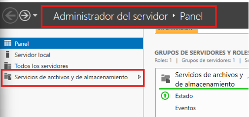

1. # Informe
   2. ## Objetivo del informe
El propósito de este informe es detallar el proceso de instalación y configuración de un servidor Windows con RAID 5, así como la creación de una red LAN. Se pretende describir cada fase, de la implementación, tocando aspectos técnicos del hardware, la configuración del sistema operativo, la gestión del almacenamiento en RAID 5 y la organización de la red.
2. # Materiales usados
## 2.1. Materiales usados
1. ### Hardware
- Ordenador:
- Placa base:  Asus PRIME B250M-A.
- Procesador: Intel® CPU G455560 @3.50GHz.
- RAM: Cruzial 4096MB 2666MHz.![ref3]

 

- Discos:
  - 3 discos con almacenamiento de 500GB
  - 1 Disco SSD de 120GB.
- Otros:
- Adaptador: NFHK Cable adaptador USB 3.0 a SATA 3.
- USB: 3.0 de 32GB.
- Tarjeta controladora RAID.
2. Softwware
- Ventoy
- ISO Windows Server 2022
- GParted
3. # Instalación de Windows Server
## 3.1. Instalación con uso de Ventoy
Haciendo uso del Ventoy y la iso de Windows Server 2022, llevaremos acabo la instalación de este.

La instalación comienza con la elección del idioma, que permanecerá durante la 

instalación y el sistema operativo, en este caso Español.![ref3]

En esta ventana se debe introducir la clave del producto.![ref3]

2 Grupo 2
![ref1]

Ahora  escogeremos  el  sistema  operativo Windows  Server  2022  Datacenter (experienza escritorio).![ref2]

Aceptamos términos y condiciones.![ref3]

2 Grupo 2
![ref1]

La instalación la haremos sobre un disco de 500GB![ref2]

Esperamos a que la instalación termine y podemos continuar.![ref3]

2 Grupo 2
![ref1]

Cuando la instalación se complete escogeremos la contraseña del administrador.![ref2]

Finalizada la instalación del Sistema Operativo Windows Server.![ref3]

2 Grupo 2
![ref1]
4. # Configuración del RAID 5![ref2]
1. ## Mediante Hardware
1. ### Primer intento
Con una tarjeta controladora de RAID, proporcionada por el profesor.
#### 4.1.1.1 Problemas
La tarjeta controladora no era compatible con la placa base. No se pudo encontrar solución a esto asi que buscamos otra opción
2. ### Segundo Intento
Haciendo uso de la funcionalidad de Windows para crear RAIDs se intento conectar 4 discos a la maquina, siendo uno el del Sistema operativo y los tres para el RAID 5.
#### 4.1.2.1 Problemas
La fuente de alimentación solo puede dar energía máximo a tres discos duros a la vez, no tiene capacidad para admitir un cuarto disco.![ref3]

2 Grupo 2
![ref1]
3. ### Tercer Intento![ref2]
También se intento fue conectar tres discos duros a la fuente de alimentación

y haciendo uso de un adaptar de USB 3.0 a SATA 3, se instalo en una SSD de 120GB el Sistema operativo Windows Server, conectado al adaptador.

#### 4.1.3.1 Problemas
El ordenador no tiene la capacidad para poder iniciar por BOOT el USB, dando pantallazos azules sin poder proseguir con el RAID 5 y perdiendo acceso al Windows Server.
### 4.1.4 Conclusión
Se llego a la conclusión que no era posible hacer un RAID 5 mediante Hardware, optando a realizar un RAID 5 por So ftwware.![ref3]

2 Grupo 2
![ref1]

2. Mediante Softwware![ref2]

4\.2.1.Grupos de Almacenamiento

Usamos un disco extra para realizar el RAID 5, primero hay que inicializar el disco. Esto se realizad des de Administración de Discos.

Se debe crear un nuevo volumen simple.![ref3]

2 Grupo 2
![ref1]

Tambien hay que reducir el tamaño del disco del sistema operativo o añadir un nuevo disco. Y añadir un disco vacio![ref2]

La letra asignada sera la D.

Ahora crearemos 3 unidades vhd en el apartado Acción.![ref3]

2 Grupo 2
![ref1]

Examinaremos donde queremos crear y guardar los archivos y el tamaño.![ref2]![ref3]

2 Grupo 2
![ref1]

Ahora ya tenemos los discos creados.![ref2]

Para continuar con en el Administrador del servidor nos dirigiremos a Servicios de archivos y de almacenamiento.

Dentro a Grupo de almacenamiento.![ref3]

2 Grupo 2
![ref1]

Debemos actualizar para buscar el grupo primordial.![ref2]

Ahora nuevo grupo.![ref3]

2 Grupo 2
![ref1]

Y ahora los pasos mas importantes. Asignar un  nombre a el grupo:![ref2]

Seleccionar el disco físico.![ref3]

2 Grupo 2
![ref1]

Crear el grupo de volúmenes.![ref2]

Esperamos que el proceso termine y cerramos la ventana.![ref3]

2 Grupo 2
![ref1]

Lo siguiente seria ir a Discos virtuales, donde tenemos que añadir el grupo que ![ref2]habíamos creado.![ref3]

2 Grupo 2
![ref1]

Ahora crearemos un nuevo disco virtual. Estas acciones las haremos para los tres discos.![ref2]

Nombre:

La distribución debe ser simple para que funcione.![ref3]

2 Grupo 2
![ref1]

Aprovisionamiento Fijo.![ref2]

El tamaño que deseamos o máximo.![ref3]

2 Grupo 2
![ref1]

Luego seria crear.![ref2]

Ahora en administrador de discos.

Podemos crear un RAID5 y ver el procedimiento de este.![ref3]

2 Grupo 2

[ref1]: ./imagenes3/Aspose.Words.f85ec990-6622-4a86-afb3-5340b525395c.001.png
[ref2]: ./imagenes3/Aspose.Words.f85ec990-6622-4a86-afb3-5340b525395c.003.png
[ref3]: ./imagenes3/Aspose.Words.f85ec990-6622-4a86-afb3-5340b525395c.004.png
